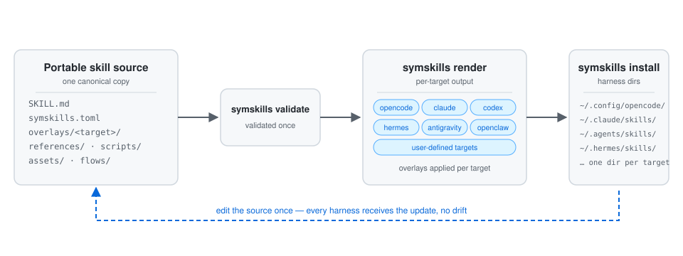

# symaira-skills

[](https://github.com/danieljustus/symaira-skills/actions/workflows/ci.yml)
[](https://github.com/danieljustus/symaira-skills/releases)

`symskills` is a local-first SSOT manager for Agent Skills. It lets users keep one portable skill source and render/install harness-specific variants for OpenCode, Claude Code, Codex, Hermes, Antigravity, and OpenClaw — plus user-defined targets via config.

The repository ships empty. It contains the tool, schema conventions, and test fixtures only. Users bring their own skill repositories.



*The `symskills` workflow: one portable skill source flows through validation, per-target rendering, and harness-specific installation — a single edit lands everywhere without drift.*

## Porting to a New Harness

See [docs/porting-to-a-new-harness.md](docs/porting-to-a-new-harness.md) for the complete checklist and code touchpoints required to add support for a new AI-agent harness.

Currently supported targets: OpenCode, Claude Code, Codex, Hermes, Antigravity, OpenClaw, and user-defined targets (see [docs/porting-to-a-new-harness.md](docs/porting-to-a-new-harness.md) for the custom-target checklist).

## Why

Most modern agent harnesses can consume a `SKILL.md`-style bundle, but they disagree on discovery paths, optional metadata, invocation policies, and install workflows. `symskills` keeps the portable source in one place and generates normal harness-readable skill folders.

Hand-copying skill folders into each harness works until it doesn't: the discovery paths differ (`~/.config/opencode/skills` vs `~/.claude/skills` vs `~/.agents/skills` vs `~/.hermes/skills/...` vs `~/.gemini/antigravity-cli/skills` vs `~/.openclaw/skills`), metadata conventions diverge, and every edit has to be re-synced by hand — with drift. `symskills` replaces that manual loop with a single canonical source that is validated once and rendered/installed per target, so a fix lands everywhere at once.

## Install From Source

```bash
go install github.com/danieljustus/symaira-skills/cmd/symskills@latest
```

During local development:

```bash
make build
./symskills --help
```

## Quick Start

```bash
symskills init
symskills import /path/to/my-skill
symskills list
symskills validate ~/.local/share/symskills/library/my-skill
symskills render --target all ~/.local/share/symskills/library/my-skill
symskills install --target opencode ~/.local/share/symskills/library/my-skill
```

Use `--json` on inspect/list/validate/render/install-style commands for machine-readable output.

Sample output (your library will differ):

```console
$ symskills list
NAME          VERSION   TARGETS           SOURCE
repo-review   1.0.0     opencode,claude   https://example.test/repo-review
```

## Skill Source Layout

```text
my-skill/
  SKILL.md
  symskills.toml              # optional
  references/                 # optional portable support files
  scripts/                    # optional portable support files
  assets/                     # optional portable support files
  flows/                      # optional symbrowse flow documents (*.yaml)
  overlays/
    opencode/
      prepend.md              # optional
      append.md               # optional
      frontmatter.toml        # optional
      blocks/                 # optional per-target block overrides
        <block-id>.md
    claude/
    codex/
    hermes/
    antigravity/
    openclaw/
```

`SKILL.md` is the canonical portable source. `symskills.toml` enables target-specific aliases and install/render preferences:

```toml
[skill]
name = "repo-review"
version = "1.0.0"
source = "https://example.test/repo-review"

[targets.opencode]
enabled = true
alias = "repo-review-opencode"
description = "OpenCode-optimized repository review workflow."

[targets.claude]
enabled = true

[targets.codex]
enabled = true

[targets.hermes]
enabled = true
category = "developer-tools"

[terms.report_dir]
default = "~/.local/state/symskills/reports"
hermes = "~/.hermes/reports"
```

An overlay `frontmatter.toml` can add target metadata:

```toml
[metadata]
workflow = "github"
audience = "maintainers"
```

## Harness Variants

Paths and metadata are not the only thing harnesses disagree about. A
Hermes-native worker contract names `delegate_task` and a tier label; the
Claude Code equivalent names the Agent tool and a git worktree. Rendering the
Hermes sentence into the Claude copy produces an install that passes every
check and then refuses itself at use time.

Harness variants keep that difference inside one canonical source. The
portable `SKILL.md` stays complete and readable on its own; each harness's
deviation is a named delta keyed to it.

Mark a replaceable region in the canonical text:

```markdown
<!-- symskills:block worker-isolation -->
Hermes only. Dispatch each worker with `delegate_task` at the configured tier.
<!-- /symskills:block -->
```

and give one target its own version in
`overlays/claude/blocks/worker-isolation.md`. Every other target keeps the
canonical text, and the markers never reach a rendered skill.

Keep or drop a region without a second file:

```markdown
<!-- symskills:only hermes,codex -->
Never invoke an external coding-agent executable.
<!-- /symskills:only -->
```

Substitute a single phrase from the `[terms]` table in `symskills.toml`:

```markdown
Persist the run report under {{term:report_dir}}/issue-sweep/.
```

Blocks and terms resolve in `SKILL.md` and in every markdown reference;
scripts, assets, and data files travel byte-identical. An override must name a
block the source defines — that rule is what keeps an overlay a delta instead
of a second, drifting copy.

`symskills render --explain` reports per target which blocks were substituted,
which term values were used, which reference files changed, and how much of
the canonical text this harness replaces. `symskills inspect` shows the same
for one skill (including disabled and refused targets), and `symskills list
--variants` gives the fleet view with one divergence figure per skill. A skill
whose render replaces most of its body is probably two skills; the figure is
reported, never enforced. `symskills validate --strict` turns warnings into a
non-zero exit for CI.

Blocks and terms are opt-in: a skill that uses neither renders byte-identical
to before. See [docs/harness-variants.md](docs/harness-variants.md) for the
full contract and the validation codes.

## Harness Capabilities

Variants let a skill adapt to a harness. They cannot make a harness do
something it has no mechanism for. A skill that needs harness-managed child
agents says so:

```toml
[skill]
requires = ["subagents"]
```

and rendering for a target that declares it lacks `subagents` is refused,
naming the skill, the target and the capability — instead of producing an
install that passes every check and then refuses itself at use time.

A capability a target has not declared is **unknown**, not absent. `symskills`
does not observe harness runtimes, so silence is missing information: an
undeclared capability renders with a warning rather than a refusal. The
built-in registry is deliberately sparse and you complete it for the harness
builds you run:

```toml
# ~/.config/symskills/config.toml
[capabilities.codex]
subagents = true
mcp = false
```

`symskills targets` shows all three states per harness, and
`--ignore-capabilities` forces a render past a refusal — with the result
declaring no `compatibility`, since a forced render does not get to assert one
the target itself denies.

`symskills validate` additionally reports `harness_coupling` when a body names
a harness in prose that every target renders. Frontmatter metadata namespaced
under a harness name (`metadata.hermes`) now travels to that harness only.

See [docs/harness-capabilities.md](docs/harness-capabilities.md) for the
vocabulary and the full contract.

## Flow Skills (symbrowse)

Flow skills are portable `SKILL.md` bundles whose body is *executed by a
tool* instead of being consumed by an agent harness. The first consumer
is `symbrowse`, which runs browser-automation flows from them.
Discovery, versioning, and distribution stay in `symskills` — the single
source of truth; symbrowse keeps no second registry (SSOT rule).

A flow skill is an ordinary skill bundle with flow documents attached.
Two layouts are supported:

```text
browser-flows/                 browser-root-flow/
  SKILL.md                       SKILL.md
  flows/                         checkout.flow.yaml
    checkout.yaml
    cleanup.yaml
```

- **`flows/` subdirectory** — every `*.yaml` file under `flows/` is a
  flow document (schema: https://symaira.dev/schemas/symbrowse-flow.json).
  Preferred layout for skills with more than one flow.
- **Root `*.flow.yaml` file** — a single flow document in the skill
  root, for skills with exactly one flow.

Flow documents are YAML **data** files, so they are ordinary skill
resources: no executable bit, no special flags, no `allow_executable`
setting needed. They travel through `import`, `render`, and `install`
like any other support file and land byte-identical in the installed
tree.

`symbrowse flow list` discovers them at runtime by running
`symskills list --json` and scanning each skill's `path` field for flow
documents — there is no compile-time import. Flow precedence is:
project-local (`./.symbrowse/flows/`) over global config
(`~/.config/symbrowse/flows/`) over symskills library flows.

See [docs/flow-skills.md](docs/flow-skills.md) for the full contract.

## Profiles

Context profiles are named collections of skill links with optional inheritance. Profiles are resolved across multiple search locations with deterministic precedence:
1. **Project**: `.symskills/profiles/` directory under the current project root.
2. **Parent**: `.symskills/profiles/` directory in parent directories of the current project (closer parents override farther parents, e.g. `parent:1` is the immediate parent).
3. **Global**: Configured global profiles directory (defaults to `~/.config/symskills/profiles`).

### Profile Format

Profiles are defined as TOML files:

```toml
name = "developer-env"
description = "A standard development environment profile"
inherits = ["base-profile"] # optional inheritance

[links.sync]
skill = "00-sync"

[links.code-review]
skill = "01-code-review"
alias = "review" # optional target-specific alias
```

## Commands

| Command | Purpose |
|---------|---------|
| `init` | Create XDG config and data directories |
| `import <skill-dir>` | Copy an existing skill into the managed library (use `--update` to re-import over an existing skill; `--batch` imports a whole directory) |
| `list` | List managed skills (with per-skill metadata; `--sort=name\|changed\|installed\|used`; `--variants` adds per-target divergence) |
| `inspect <skill-dir>` | Show parsed SKILL.md + symskills metadata, plus what each target's render diverges by |
| `validate <skill-dir>` | Validate portable skill metadata and references (`--strict` fails on warnings too) |
| `render [skill-dir]` | Render target-specific skill folders (or use `--profile <name>`; `--explain` reports the harness variants each target resolved, `--ignore-capabilities` forces a refused target) |
| `diff <skill-dir>` | Compare rendered output with installed target |
| `history <skill>` | List the versioned commit history of a skill (revision, timestamp, operation, changed files) |
| `show <skill> --rev <rev>` | Show a skill's state at a past revision (`--diff` adds a diff against the current state) |
| `restore <skill> --to <rev>` | Roll a skill's files back to a previous revision by forward commit (`--dry-run`, `--allow-dirty`, `--sync`) |
| `install [skill-dir]` | Render and install a target-specific skill (or use `--profile <name>`) |
| `uninstall <name>` | Remove a managed installed skill |
| `profile list` | List available context profiles |
| `profile resolve <profile-name>` | Resolve a profile and print its merged skill set |
| `profile validate <profile-name>` | Validate a profile's structure and link targets |
| `targets` | Read-only inventory and readiness status for AI-agent harnesses, including declared runtime capabilities |
| `discover [paths...]` | Discover unmanaged skill sources in harness roots or explicit paths |
| `doctor` | Print config, library, render, and target paths plus per-skill versioning status |
| `serve --stdio` | Serve MCP tools over stdio |

## Per-Skill Versioning

Every skill in the managed library owns an **independent git repository**
(`~/.local/share/symskills/library/<name>/.git`), initialized automatically
on import. One repo per skill — never one repo for the whole library — so a
skill can be inspected, reverted, exported or shared without dragging along
unrelated skills. The repositories are local-only: no remote is ever
configured, pushed to or fetched from.

How it works:

- **Import**: `symskills import <dir>` copies the skill and leaves a
  repository with exactly one commit containing the full skill.
- **Update**: `symskills import --update <dir>` re-imports over an existing
  library skill (its `.git` survives the swap) and records the change as a
  new commit. Importing over an existing skill without `--update` still
  refuses, as before.
- **Every write is committed**: any change symskills itself performs on a
  library skill is committed with a message naming the operation, e.g.
  `update: skill demo from /path/to/demo`. Read-only operations (`list`,
  `inspect`, `validate`, `render`, `diff`) never commit.
- **Commits only after success**: the commit happens after the write
  completed, so history never shows a state that was never on disk.
- **User commits are preserved**: symskills never uses `--force`, never
  resets and never rewrites history — automatic commits are always added on
  top of HEAD. A hand-made commit inside a skill repo survives the next
  write unchanged.
- **`doctor`** reports the versioning status per skill (`versioned` /
  `unversioned`) plus whether the toggle is on and git is available.

Opting out and degradation:

- Set `vcs.enabled = false` in `~/.config/symskills/config.toml` (or
  `.symskills.toml`) to disable all repository writes. Versioning is on by
  default.
- When the `git` binary is missing, every operation still succeeds;
  versioning is simply reported unavailable — once per command, not per
  skill.

Bundles stay clean: `.git` is excluded from render, install and diff, so a
versioned skill never leaks repository internals into a harness.

Note on disk usage: a per-skill repository stores a full copy of every
changed file. Skills with large `assets/` directories grow accordingly; if
that matters, opt out with `vcs.enabled = false`.

The commit history is a usable undo surface — see
[History, Show and Restore](#history-show-and-restore) for the CLI and MCP
commands that read and roll back revisions.

## History, Show and Restore

Three commands turn the per-skill repositories into a usable undo surface,
from the CLI and from the MCP tools (`skills_history`, `skills_restore`):

- `symskills history <skill> [--limit N] [--json]` lists the commits
  newest first: revision, timestamp, the operation that produced the
  commit (`import`, `update`, `restore`; `unknown` for hand-made commits)
  and the files it changed.
- `symskills show <skill> --rev <rev> [--diff] [--json]` prints the
  skill's `SKILL.md` and resource tree exactly as committed at `--rev`
  (any revision expression: hash, prefix, `HEAD~1`, ...). `--diff` adds a
  unified diff of that revision against the current working tree.
- `symskills restore <skill> --to <rev> [--dry-run] [--allow-dirty]
  [--sync] [--json]` returns the skill's files to the state at `--rev`.

How restore stays safe:

- **Forward commit, never a rewrite**: the undo is `git add -A` plus a
  commit on top of `HEAD`, exactly like every other symskills write. The
  intermediate history stays intact and the restore commit itself can be
  undone like any other change.
- **Validated before writing**: the revision's tree is extracted, loaded
  and validated first; restoring to a revision whose `SKILL.md` is
  invalid is refused, naming every validation error.
- **Uncommitted changes are never discarded**: a skill with uncommitted
  local changes is refused unless `--allow-dirty` is given, which commits
  them first as a pre-restore snapshot.
- **`--dry-run` writes nothing**: it prints the plan — resolved revision,
  validation result, files that would change, pending dirty snapshot.
- **Installs stay in sync**: after a restore the installed copies are
  stale relative to the restored library state. Every stale target is
  reported with the `symskills sync` resync path from #115; `--sync`
  re-installs them immediately.

`skills_history` takes `name` (and optional `limit`) and returns the same
snake_case payloads as the CLI's `--json` output. `skills_restore` takes
`name` and `rev` (plus `dry_run`, `allow_dirty`, `sync`) and, like
`skills_install`, defaults to dry-run: pass `dry_run=false` to write.

## Install Safety

`symskills` renders into `~/.local/share/symskills/rendered` first, then installs into the target harness. It refuses to overwrite or remove an install path unless that path contains a `.symskills.json` marker.

Default user install paths:

| Target | Path |
|--------|------|
| OpenCode | `~/.config/opencode/skills/<name>` |
| Claude Code | `~/.claude/skills/<name>` |
| Codex | `~/.agents/skills/<name>` |
| Hermes | `~/.hermes/skills/symaira/<name>` |
| Antigravity | `~/.gemini/antigravity-cli/skills/<name>` |
| OpenClaw | `~/.openclaw/skills/<name>` |

Antigravity and OpenClaw paths follow their official docs
(antigravity.google/docs/skills, docs.openclaw.ai/tools/skills). At project
scope both harnesses read `<project>/.agents/skills` — the same workspace
skills directory Codex uses — so project-scope installs for those three
targets converge on one directory, exactly as the harnesses themselves do.

## Per-Skill Metadata

Every library skill carries a queryable metadata record, exposed as
`created_at`, `modified_at`, `last_rendered_at`, `installs[]` (each with
`target`, `path`, `installed_at`), `last_used` and `last_used_source` in:

- `symskills list --json` (the table output gains CHANGED and INSTALLED
  columns; `--sort=name|changed|installed|used` orders the rows)
- `symskills inspect` (and `inspect --json`)
- the `skills_list` / `skills_inspect` MCP tools (same snake_case fields)

The fields are derived, never guessed, and degrade cleanly when their
source is absent (fresh install, imported library, no git history):

| Field | Source |
|-------|--------|
| `created_at` | Skill directory mtime (filesystem). Per-skill git history will replace this once it lands; the filesystem remains the fallback. |
| `modified_at` | Newest file mtime in the skill directory (`.git` excluded). |
| `last_rendered_at` | Most recent successful `render` record in the lifecycle event log; falls back to the install marker's rendered-tree mtime. |
| `installs[]` | Most recent successful `install` / `profile_install` record per target in the lifecycle event log; targets missing from the log fall back to the `.symskills.json` install marker. |
| `last_used` | Best-effort, explicitly limited signal — see below. `null` (or `unknown` in text output) when there is no evidence; a wrong "last used" is worse than none. |
| `last_used_source` | Name of the evidence source behind `last_used` (`install_atime`, a registered harness adapter, or empty). |

### Limits of the last-used signal

`symskills` cannot observe how often a harness invokes a skill: the harness
loads the skill folder directly and `symskills` is not in that path. The
`last_used` value is therefore best-effort by design:

- The default source is the **access time of an installed copy** (`install_atime`),
  reported only when the filesystem records a useful one (atime newer than
  the file's own mtime, i.e. a read after the install write). On
  `relatime`/`noatime` mounts atime is unreliable, so it is treated as one
  possible evidence source among several, always reported alongside its
  source, never as a guarantee.
- An **opt-in adapter** may register additional sources that read a
  harness's own session/skill log where one exists and is documented:
  `metadata.RegisterUsageProbe` (name + lookup function). No adapter is
  registered by default and symskills never fabricates usage data.
- No network transmission, no per-invocation analytics, no counters beyond
  a last-seen timestamp. Per-invocation tracking that would require
  modifying the harness or injecting a wrapper is explicitly out of scope.

## MCP Tools

```bash
symskills serve --stdio
```

Exposes:

- `skills_list`
- `skills_inspect`
- `skills_validate`
- `skills_profile_list`
- `skills_profile_resolve`
- `skills_render_plan`
- `skills_install`
- `skills_targets_status`
- `skills_discover_sources`
- `skills_history`
- `skills_restore`

`skills_install` and `skills_restore` default to dry-run mode. Pass
`dry_run=false` to perform writes.

## Development

```bash
make test
make lint
make build
```

Release history and the update convention for user-visible changes live in
[CHANGELOG.md](CHANGELOG.md).

## License

Apache-2.0 - Daniel Justus
